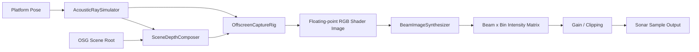

# Acoustic Simulation Core (`sonar_core` + `sonar_imaging`) Overview

## 1. Goal and Scope

This document describes the acoustic simulation core of EchoVerse Sonar Lab, focusing on two layers:

- `sonar_imaging`: generates intermediate depth/normal images from a 3D scene for acoustic inversion.
- `sonar_core`: converts intermediate images into sonar intensity data across multiple beams and range bins.

The core entry point is `sonar_core::AcousticRaySimulator`, and its single-ping path is:
`updateCapturePose -> captureNodeImage -> ingestShaderFrame -> buildSonarSample`.

---

## 2. Program Diagram (Module Level)



---

## 3. Program Diagram (Single-Ping Flow)

```mermaid
flowchart TD
    P0[Input: pose, range, gain, beam/bin params, environment params] --> P1[Update capture camera pose]
    P1 --> P2[Shader generates primary and reverb reflections]
    P2 --> P3[Write channels: normalized range y, normal echo z]
    P3 --> P4[Water attenuation: z = z * exp(-2*a*r)]
    P4 --> P5[Split ROI by beam]
    P5 --> P6[Map depth to bins and accumulate energy]
    P6 --> P7[Optional speckle noise]
    P7 --> P8[Apply output gain and clipping]
    P8 --> P9[Pack Sonar struct]
```

---

## 4. Key Values and Formulas

### 4.1 Configuration-Side Derivation (FLS/MBES Modules)

The discrete parameters used to initialize `AcousticRaySimulator` are typically derived from UI parameters:

\[
N_{bin} = \left\lfloor \frac{B \cdot 2R}{c} \right\rfloor
\]

- \(B\): bandwidth (Hz, converted from kHz in code)
- \(R\): range (m)
- \(c\): sound speed (m/s)

\[
N_{beam} = \left\lfloor \frac{\Theta_{az}}{\Delta\theta} \right\rfloor
\]

- \(\Theta_{az}\): horizontal sector angle (deg)
- \(\Delta\theta\): angular resolution (deg)

### 4.2 Field-of-View to Pixel Width/Height Mapping (Offscreen Capture)

In fixed-height mode (`isHeight=true`):

\[
W = \left\lfloor H \cdot \frac{\tan(\frac{\mathrm{FOV}_x}{2})}{\tan(\frac{\mathrm{FOV}_y}{2})} \right\rfloor
\]

In fixed-width mode:

\[
H = \left\lfloor W \cdot \frac{\tan(\frac{\mathrm{FOV}_y}{2})}{\tan(\frac{\mathrm{FOV}_x}{2})} \right\rfloor
\]

The implementation also enforces a maximum RTT size while preserving aspect ratio.

### 4.3 Beam Column LUT (Pixel Column to Beam)

The column boundaries of each beam are computed via perspective projection:

\[
\Delta\phi = \frac{\Theta_{az}}{N_{beam}},\quad
f = \frac{W/2}{\tan(\Theta_{az}/2)}
\]

\[
x_{L,i} = \mathrm{round}\Big(\frac{W}{2} + \tan(-\Theta_{az}/2 + i\Delta\phi)\cdot f\Big)
\]

\[
x_{R,i} = \mathrm{round}\Big(\frac{W}{2} + \tan(-\Theta_{az}/2 + (i+1)\Delta\phi)\cdot f\Big)
\]

### 4.4 Range Channel to Bin Mapping

The green channel of the shader image stores normalized range \(d_n\in[0,1]\), mapped to bins as:

\[
k = \left\lfloor d_n \cdot (N_{bin}-1) \right\rfloor
\]

### 4.5 ROI Energy Accumulation and Normalization

For a given beam ROI, count the pixel population per bin \(H_k\), then accumulate by normal echo value:

\[
I_k = \sum_{p\in ROI_k}\frac{1}{H_k}\cdot \sigma(z_p)
\]

Here \(z_p\) is the pixel normal-echo channel, and \(\sigma(\cdot)\) is a logistic response:

\[
\sigma(x)=\frac{1}{2}\tanh\!\left(\frac{s(x-m)}{2}\right)+\frac{1}{2}
\]

The implementation constants are \(s=18,\ m=2/3\).

### 4.6 Water Absorption and Two-Way Propagation Attenuation

The water absorption coefficient is composed of three terms:

\[
\alpha_{\mathrm{dB/km}}=\alpha_{boric}+\alpha_{MgSO_4}+\alpha_{water}
\]

Then converted to \(Np/m\):

\[
\alpha_{Np/m} = -\ln\left(10^{-\frac{\alpha_{\mathrm{dB/km}}/1000}{20}}\right)
\]

Fragment intensity applies two-way propagation attenuation:

\[
z' = z\cdot e^{-2\alpha r}
\]

where \(r = d_n \cdot R_{max}\).

### 4.7 Speckle Noise and Output Gain

Optional speckle noise uses multiplicative Gaussian form:

\[
I_k \leftarrow \max(I_k, I_{min})\cdot \left| \mathcal{N}(\mu,\sigma^2) \right|
\]

Implementation parameters: \(\mu=0.95,\ \sigma=0.30,\ I_{min}=0.03\).

Output gain and clipping:

\[
I_k^{out} = \min(1,\ 2g\cdot I_k),\quad g\in[0,1]
\]

### 4.8 Range Sampling Time

Two-way propagation time:

\[
T_{2way} = \frac{2R}{c}
\]

Two-way time interval per bin:

\[
\Delta t_{2way} = \frac{T_{2way}}{N_{bin}}
\]

The current implementation writes `sonar_sample.bin_duration` as:

\[
bin\_duration = \frac{\Delta t_{2way}}{2}
\]

---

## 5. Output Data Semantics

`BeamImageSynthesizer::buildSonarSample` packs:

- `bin_count`, `beam_count`
- `beam_width`, `beam_height`
- `speed_of_sound`
- `bins` (stored continuously by beam, with `bin_count` intensity values per beam)

Therefore, this core can be viewed as a unified transformer from
"**geometry/material scene -> acoustic intensity grid**".
FLS, MBES, and SSS all reuse the same computation skeleton, differing mainly in sensor layout and upper-layer display strategy.

---

## 6. Engineering Usage Recommendations (Brief)

- To improve short-range detail, prioritize increasing `N_bin` (jointly determined by bandwidth, range, and sound speed).
- To improve azimuth resolution, prioritize increasing `N_beam`, and verify that offscreen resolution is sufficient.
- When attenuation is enabled, use realistic environmental parameters (temperature, salinity, depth, pH) to avoid intensity distortion.
- For algorithm comparison experiments, keep `speckle/reverb/attenuation` switches fixed to preserve reproducibility.
