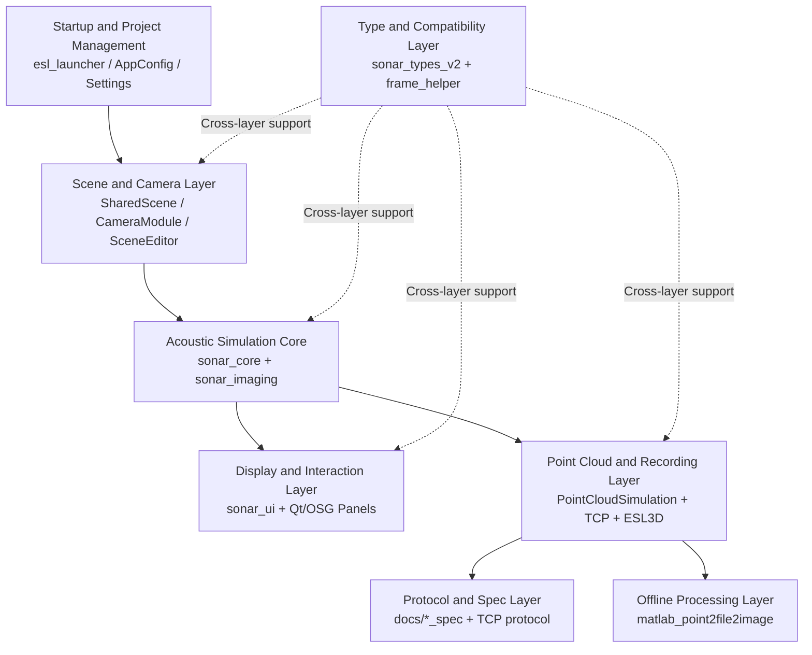
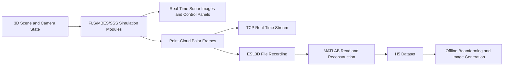

# EchoVerse Sonar Lab Software Architecture Analysis

## 1. Document Goal and Scope

This document provides a structured architecture-level explanation for the entire `echoverse_sonar_lab` project, focusing on:

- which core modules compose the system,
- how these modules are connected at runtime and in engineering structure,
- how the online simulation pipeline collaborates with the offline data pipeline,
- architectural characteristics in extensibility, maintainability, and reproducible research experiments.

This document intentionally avoids specific function names and emphasizes module roles and system relationships.

## 2. Overall Architecture View

The system can be abstracted as a layered architecture:
"startup/configuration layer -> scene and sensing layer -> acoustic imaging layer -> visualization/interaction layer -> data exchange layer -> offline analysis layer".

## 3. Core Module Breakdown

### 3.1 Startup and Project Management Layer

This layer consists of launcher and configuration subsystems and is responsible for engineering lifecycle management:

- The launcher handles project creation, recent-project maintenance, and runtime entry orchestration.
- The configuration subsystem uses `.eslproj` as the core contract to describe scenes, poses, environment, sonar parameters, and module bindings in a unified way.
- The config schema preserves legacy-field mirrors to reduce migration friction across versions.
- The build system uses CMake + vcpkg to clearly declare dependency boundaries for Qt / OSG / OpenCV.

This layer provides a reproducible experiment-configuration foundation, turning parameter state into an explicit asset.

### 3.2 Scene and Camera Layer

This layer is responsible for 3D world loading, camera-system organization, and view synchronization:

- A shared scene graph manages world models and visualization nodes.
- The world-editor subsystem supports add/edit/remove operations for model entries and preview reload.
- Main camera plus multiple aux cameras form a bindable observation array for multimodal FLS / MBES / SSS deployment.
- Viewport and geometric relationships are coordinated in this layer, reducing geometric coupling in upper sensor modules.

This layer is essentially the sensor-deployment context and determines the geometric preconditions of sonar observation.

### 3.3 Acoustic Simulation Core Layer

This layer is the physical and signal-computation center of the system, mainly composed of `sonar_core` and `sonar_imaging`:

- The imaging frontend builds an intermediate domain for acoustic inversion using offscreen capture and combined depth/normal representation.
- The acoustic computation module synthesizes energy along beam and range dimensions and injects environmental effects such as attenuation, reverb, and speckle.
- FLS, MBES, and SSS modules run on a shared framework, differing mainly in geometric binding and display strategy.
- This layer is decoupled from the scene layer, allowing multi-module parallel simulation on the same world graph.

From an architectural perspective, this layer provides a unified sonar-generation semantics and is key to multimodal capability sharing.

### 3.4 Display and Interaction Layer

Centered around Qt + OSG, this layer forms a composite interaction interface for experiment control and result interpretation:

- Control panels provide interactive parameters such as gain, range, palette, and grid.
- Side-scan waterfall uses temporal scrolling to represent time-accumulated port/starboard data.
- Info panels continuously summarize runtime metrics (pose, frequency, environmental parameters, frame rate, etc.).
- Settings and scene-editor panels together provide a dual-channel control path: parameter governance + spatial governance.

This layer is not just visualization; it is the human-in-the-loop parameter-tuning hub in the simulation feedback loop.

### 3.5 Point Cloud and External Interface Layer

This layer converts internal simulation outputs into exchangeable data assets:

- The point-cloud simulation subsystem outputs polar images and 3D point sets, while preserving sampling budget and configuration snapshots.
- The real-time interface publishes continuously using a TCP frame protocol.
- The file interface records data using appendable binary `.esl3d` format.
- Protocol and data-spec documents form machine-readable contracts for cross-process and cross-language consumption.

This layer evolves the system from a closed-loop simulator into an integrable data-service node.

### 3.6 Type and Compatibility Support Layer

This layer includes `sonar_types_v2` and `frame_helper`:

- `sonar_types_v2` provides unified data abstractions for time, angle, pose, and sonar frames.
- `frame_helper` provides image conversion and calibration-related capabilities while preserving compatibility interfaces with existing vision pipelines.
- Together they align data semantics across modules and reduce risks from implicit inter-module data assumptions.

This layer reflects a data-model-first engineering strategy.

### 3.7 MATLAB Offline Pipeline

`matlab_point2file2image` forms the offline research pipeline:

- reads point-cloud/polar data from `.esl3d`,
- generates or writes `.h5` datasets,
- performs matched filtering, time-varying gain, beamforming, and sector imaging,
- outputs visualized results and animated image assets.

This path complements the C++ real-time pipeline and forms a dual-track research paradigm: online interaction + offline analysis.

## 4. Relationship Between Online and Offline Pipelines

This relationship shows that the online pipeline handles interactive experiment generation, while the offline pipeline handles reproducible experiment analysis. They are coupled through a unified data contract.

## 5. Module Coupling and Boundary Characteristics

- **Highly cohesive modules**: `sonar_core`, `sonar_imaging`, `sonar_ui`, and `sonar_palette` define clear domain boundaries.
- **Mediator modules**: `FlsModule`, `MbesModule`, and `SssModule` orchestrate scene, parameters, display, and output into runnable units.
- **Boundary-contract modules**: `PointCloudTcpStreamer` and spec docs in `docs` jointly define externally consumable interfaces.
- **Cross-cutting common modules**: `AppConfig` and `sonar_types_v2` play central roles in cross-layer semantic consistency.
- **Research-extension modules**: the MATLAB script stack and C++ main program are connected by file protocols, making them naturally suitable for algorithm iteration and paper-result reproduction.

## 6. Architecture Conclusion

The current EchoVerse Sonar Lab architecture can be summarized as:

1. multimodal sonar simulation as the core capability,
2. reproducibility guaranteed by configuration-driven workflows and type contracts,
3. a research-oriented workflow supported by parallel real-time interaction and offline analysis,
4. protocolized data export that improves external integration capability.

Overall, the project demonstrates strong research-engineering characteristics: it supports interactive experiments while preserving the structural conditions needed to reproduce results across toolchains.

