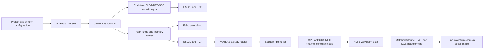

# EchoVerse Sonar Lab Software Architecture

## 1. Scope

EchoVerse Sonar Lab is a two-runtime system. The online C++ application and the
offline MATLAB pipeline use the same recorded sensor configuration and are connected
by documented ESL3D and HDF5 formats, but they do not perform the same computation.

The central boundary is:

- **C++ produces real-time echo/intensity images and geometric echo point clouds.**
- **MATLAB converts the C++ point-cloud data into received channel waveforms and the final signal-processed sonar image.**

Consequently, an ESL3D frame is an intermediate range/intensity representation, not
the final raw receive waveform.

## 2. End-to-End Architecture

```mermaid
flowchart LR
    A[Project and sensor configuration] --> B[Shared 3D scene]
    B --> C[C++ online runtime]
    C --> D[Real-time FLS/MBES/SSS echo images]
    C --> E[Polar range and intensity frames]
    E --> F[Echo point cloud]
    D --> G[ESL2D and TCP]
    E --> H[ESL3D and TCP]
    H --> I[MATLAB ESL3D reader]
    I --> J[Scatterer point set]
    J --> K[CPU or CUDA MEX channel echo synthesis]
    K --> L[HDF5 waveform data]
    L --> M[Matched filtering, TVG, and DAS beamforming]
    M --> N[Final waveform-domain sonar image]
```

## 3. C++ Online Runtime

### 3.1 Project, scene, and camera layer

`AppConfig`, `SharedScene`, the scene editor, path controller, and camera modules load
project configuration and maintain a shared scene graph. Sensor modules receive poses
derived from their camera bindings.

On Windows, the OSG main view retains its native-window integration. On Linux, the
main view uses `MainCameraView`: OSG renders to an offscreen texture and the result is
copied into a Qt widget. This avoids X11 window re-parenting and supports both X11 and
Wayland.

### 3.2 Real-time echo-image layer

`sonar_imaging` renders scene depth and return-intensity channels. `sonar_core`
converts those intermediate channels into beam-by-bin intensity samples. `FlsModule`,
`MbesModule`, and `SssModule` use this path for real-time visualization and ESL2D
output.

These samples are processed intensity-domain data. They should not be described as
multi-channel raw receive waveforms.

### 3.3 Echo-point-cloud layer

`PointCloudSonarSimulation` produces polar range/intensity arrays and reconstructs
valid samples as 3D points. FLS and MBES modules can display, stream, or record this
representation. ESL3D stores the metadata, range image, and intensity image required
to reconstruct the point cloud offline.

### 3.4 Data and session layer

`OutputController`, `Esl2dFileWriter`, `PointCloudTcpStreamer`, and `SonarTcpHub`
manage session directories, file recording, and network output. Packet definitions
are documented separately so that external consumers can parse them without linking
the GUI application.

## 4. MATLAB Offline Runtime

The MATLAB path begins only after an ESL3D file has been generated by C++:

1. `SceneInit` and `esl3d` parse metadata, range, and intensity frames.
2. `getPointCloud` maps each valid polar sample to a Cartesian scatterer point.
3. `PointCloudDecimate` optionally reduces the scatterer count.
4. `EchoInit` calls either `sim_rx_from_scatterers_perTX` or the compiled
   `sim_rx_from_scatterers_perTX_cuda_mex` backend to synthesize received channels.
5. Doppler-like resampling, AWGN, down-conversion, filtering, and decimation produce
   complex baseband waveforms.
6. `SonarDataMaker` stores waveform data in HDF5.
7. `file2image` applies matched filtering, TVG, delay-and-sum beamforming, and sector
   mapping to form the final offline image.

The CUDA source file is not loaded directly by MATLAB. It must first be compiled with
`mexcuda`; see the offline-pipeline document for the exact command.

## 5. Responsibility and Output Matrix

| Function | C++ | MATLAB |
|---|---:|---:|
| Interactive 3D scene and vehicle/sensor pose | Yes | No |
| Real-time echo/intensity image | Yes | No |
| Polar range/intensity frame | Yes | Reads |
| Echo point-cloud reconstruction | Yes | Reconstructs from ESL3D for signal synthesis |
| TCP streaming and packet recording | Yes | Reads recorded data |
| Multi-channel receive-waveform synthesis | No | Yes |
| Doppler/noise signal processing | No in the offline waveform path | Yes |
| HDF5 waveform export | No | Yes |
| Matched filtering, TVG, DAS image reconstruction | No in the offline waveform path | Yes |

## 6. Concurrency and HPC Boundary

Multiple sonar modules share one scene and are independently configurable, but this
does not mean the current release provides distributed or HPC execution. The GUI
viewer is intentionally single-threaded for rendering stability. The MATLAB
`pointcloud2file` loop processes frames sequentially, although an individual echo
synthesis call can use the optional CUDA MEX backend.

The current release has no native MPI, Slurm, Kubernetes, or cluster-job interface.
Independent scenes, paths, or recordings may be distributed as separate processes by
an external scheduler if each job uses isolated output paths, but this is an
experiment-orchestration strategy rather than a built-in capability.

## 7. Performance Observability

The opt-in profiler records:

- scene node, drawable, vertex, and estimated triangle counts;
- main-view rendering time;
- FLS, MBES, and SSS real-time ping time;
- point-cloud requested/recovered sample counts and output size estimates;
- MATLAB per-frame ESL3D read, decimation, echo-synthesis, and HDF5-write time;
- CPU or CUDA MEX backend selection.

See `performance_and_scalability.md` for environment variables, CSV fields, and the
recommended small/medium/large experiment matrix.

## 8. Architecture Summary

EchoVerse Sonar Lab connects a responsive C++ geometry/intensity simulator with a
MATLAB waveform-synthesis and image-reconstruction pipeline. The ESL3D boundary is
the key reproducibility contract: it transfers C++-generated point-cloud information
to MATLAB without claiming that the C++ stage has already produced the final raw
echo waveform.

