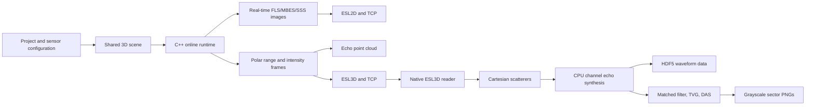

# EchoVerse Sonar Lab Software Architecture

## 1. Scope and Processing Boundary

EchoVerse Sonar Lab is a single C++ application with two connected processing paths:

- the online path renders the interactive scene, produces real-time intensity data,
  streams packets, and records ESL2D/ESL3D;
- the native offline path converts a completed ESL3D recording into receive-channel
  waveforms, HDF5, and beamformed PNG images.

An ESL3D frame is an intermediate range/intensity representation, not a raw receive
waveform. The two paths share this documented boundary while remaining different
computations.

Together, the online and native offline paths form a self-contained product
workflow; MATLAB is not required to record data, synthesize waveforms, write HDF5,
or reconstruct images. The MATLAB code under `src/matlab_point2file2image/` is
provided separately for research post-analysis, parameter studies, reproducibility
checks, alternative visualization, and comparison with the native pipeline. It is
not an execution fallback or deployment dependency.

## 2. End-to-End Architecture

```mermaid
flowchart LR
    A[Project and sensor configuration] --> B[Shared 3D scene]
    B --> C[C++ online runtime]
    C --> D[Real-time FLS/MBES/SSS images]
    C --> E[Polar range and intensity frames]
    E --> F[Echo point cloud]
    D --> G[ESL2D and TCP]
    E --> H[ESL3D and TCP]
    H --> I[Native ESL3D reader]
    I --> J[Cartesian scatterers]
    J --> K[CPU channel echo synthesis]
    K --> L[HDF5 waveform data]
    K --> M[Matched filter, TVG, DAS]
    M --> N[Grayscale sector PNGs]
```

## 3. Online Runtime

### 3.1 Project, scene, and camera layer

`AppConfig`, `SharedScene`, the scene editor, path controller, and camera modules load
the project configuration and maintain a shared scene graph. Sensor modules receive
poses derived from their camera bindings.

On Windows, the OSG main view uses native-window integration. On Linux,
`MainCameraView` renders OSG to an offscreen texture that is displayed in a Qt widget,
which supports both X11 and Wayland.

### 3.2 Real-time echo-image layer

`sonar_imaging` renders scene depth and return-intensity channels. `sonar_core`
converts them into beam-by-bin intensity samples. `FlsModule`, `MbesModule`, and
`SssModule` use this path for real-time visualization and ESL2D output.

These are processed intensity-domain samples, not multi-channel raw waveforms.

### 3.3 Point-cloud and session layers

`PointCloudSonarSimulation` produces polar range/intensity arrays and reconstructs
valid samples as 3D points. FLS and MBES can display, stream, or record this data.
`OutputController`, `Esl2dFileWriter`, `PointCloudTcpStreamer`, and `SonarTcpHub`
manage session directories, recording, and network output.

## 4. Native Offline Processing Library

`src/offline_processing/` is a static library linked to the GUI target. Its main API,
`process_esl3d_to_images`, performs:

1. sonar JSON parsing and LFM/CDM/FDM excitation generation;
2. ESL3D range/intensity decoding and Cartesian point recovery;
3. CPU receive-channel echo synthesis;
4. Doppler resampling, AWGN, baseband mixing, FIR filtering, and decimation;
5. MATLAB-compatible HDF5 serialization;
6. matched filtering, TVG, delay-and-sum beamforming, sector mapping, and PNG output.

`SonarOutputUtil` launches this function with `std::async` and forwards thread-safe
progress snapshots to Qt. The configuration file is read-only: session paths are
passed as in-memory overrides. The library contains a disabled CUDA-backend shim so
the port cannot fall through to the source project's standalone `echo_cuda.exe` path.
No converter or accelerator child process is created.

## 5. Responsibility and Output Matrix

| Function | Online C++ path | Native offline C++ path |
|---|---:|---:|
| Interactive scene and sensor pose | Yes | Reads recorded metadata |
| Real-time echo/intensity image | Yes | No |
| Polar range/intensity frame | Produces | Reads from ESL3D |
| Cartesian echo point cloud | Produces/displays | Reconstructs for signal synthesis |
| TCP streaming and packet recording | Yes | No |
| Multi-channel receive waveform | No | Yes |
| Doppler/noise signal processing | No in waveform domain | Yes |
| HDF5 waveform export | No | Yes |
| Matched-filter/TVG/DAS reconstruction | No in waveform domain | Yes |

## 6. Concurrency and HPC Boundary

The GUI viewer is intentionally single-threaded for rendering stability. Offline
processing runs on one background task so the UI can remain responsive. Frames are
processed sequentially, while receive channels and selected DSP loops use OpenMP when
available.

The current release has no MPI, Slurm, Kubernetes, or distributed job interface.
Independent recordings can be scheduled as isolated external jobs, but that is an
experiment-orchestration strategy rather than a built-in cluster capability.

## 7. Performance Observability

The online profiler records scene inventory, rendering time, sonar ping time,
point-count metrics, and output estimates through `ESL_CPP_PERF_CSV`. The offline
pipeline records per-frame read, filtering/capping, echo-synthesis, HDF5-write, total
time, dimensions, and CPU backend through `ESL_OFFLINE_PERF_CSV`.

See [`performance_and_scalability.md`](performance_and_scalability.md) for the exact
variables, fields, and experiment rules.

## 8. Architecture Summary

EchoVerse Sonar Lab connects an interactive geometry/intensity simulator to an
embedded waveform-synthesis and image-reconstruction library. ESL3D is the stable
reproducibility contract between those stages; HDF5 and PNG are the offline outputs.
The native paths complete the product workflow, while the retained MATLAB sources
provide an optional research-analysis environment around the same data contract.
