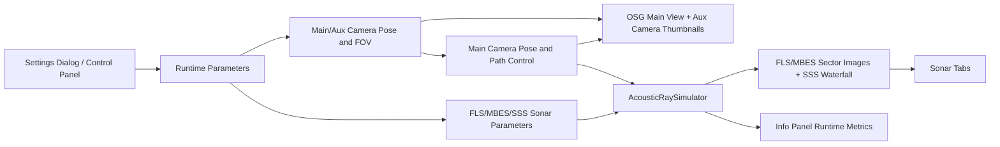

# Visualization and Interactive Control

## 1. Document Goal

This document describes the visualization and interactive-control capabilities of EchoVerse Sonar Lab, focusing on four aspects:

- image display and parameter control for FLS / MBES / SSS,
- camera display and parameter control in the main dashboard,
- GUI main-window structure and runtime information presentation,
- interaction methods and runtime logic of the Main Camera.

---

## 2. Overall Interaction Diagram

---

## 3. GUI Main Interface Structure

The main interface consists of the `EchoVerse Sonar Lab` dashboard and sonar image windows:

- **Top Bar**
  - `Settings`: opens the parameter configuration dialog.
  - `Scene Editor`: opens the scene editor (add/edit/remove models + write back to world file).
- **Left Panel (InfoPanel)**
  - `Operation Tips`: shows main control hotkeys.
  - `Runtime`: position, pose, range/gain, frequency, bin/beam.
  - `Pose Details`: world name, XYZ, Yaw/Pitch, step sizes, auto-pose toggle.
  - `Sonar Status`: beam angle, resolution, FPS, Reverb/Speckle/Attenuation, environment parameters.
- **Center Panel (Main Viewer)**
  - Main OSG view (Main Camera).
  - Overlay label `Optical capture image`.
  - Bottom aux-camera strip (real-time image + runtime state per camera).
- **Sonar Tabs / Side-Scan Window**
  - FLS, MBES, and SSS image windows.
  - Multiple modules are displayed side by side using tabs.

---

## 4. FLS / MBES / SSS Display and Parameter Control

## 4.1 FLS and MBES (`SonarControlPanel` + `SonarCanvas`)

FLS and MBES 2D visualization use the same control framework:

- **Display form**
  - sector image (main area),
  - right-side color bar (0-255 colormap),
  - grid overlay (concentric arcs + azimuth lines + range labels).
- **Control parameters**
  - `Gain` slider (0-100%),
  - `Range` slider (meters),
  - `Palette` (`Jet` / `Hot` / `Gray` / `Bronze`),
  - `Grid` toggle.
- **Control pipeline**
  - UI sliders trigger `gainChanged/rangeChanged`,
  - module updates `runtime_gain/runtime_range_m`,
  - each frame writes to `AcousticRaySimulator::setGain/setRange`,
  - new parameters apply immediately to echo intensity and display overlays.

### Parameter-to-Display Behavior

- `Gain`: linearly amplifies output-bin intensity and clips to [0,1], directly affecting brightness/contrast.
- `Range`: affects simulation sampling length and range-scale labels on the grid.
- `Palette`: changes color mapping only, not raw acoustic intensity.
- `Grid`: affects overlays only, useful for reading values and judging pose.

---

## 4.2 SSS (`SideScanControlPanel` + `SideScanWaterfallCanvas`)

SSS is displayed as a stitched port/starboard waterfall image:

- **Display semantics**
  - x-axis: cross-track range (`-range` to `+range`), left is Port and right is Starboard,
  - y-axis: time history, newest ping at the bottom,
  - center line plus 1/4 and 3/4 vertical guides for fast side-structure localization.
- **Data organization**
  - Port and Starboard each use the `beam0` bin sequence,
  - Port is reversed and placed on the left half; Starboard is placed on the right half,
  - history rows shift upward each frame, and the newest strip is written at the bottom.
- **Control parameters**
  - `Gain`, `Range`, `Palette`, `Grid` are consistent with FLS/MBES,
  - `Update Stride` controls SSS update interval (frame stride).

### SSS Dual-Camera Binding Rules

- SSS requires two camera slots (A/B).
- If either binding is missing or a camera is disabled, UI shows a not-ready hint.
- When bindings are valid, port/starboard pings are generated from the two corresponding aux-camera poses.

---

## 5. Camera Display and Visual Parameter Control in Main Interface

## 5.1 Main Camera Display

- Main-camera rendering is embedded in the dashboard center area.
- The display area adapts to the main camera FOV aspect ratio to avoid stretching.
- Main-camera view is used both for user observation and as the default sonar pose source (when bound to Main Camera).

## 5.2 Aux/Sub Camera Display

- Each aux camera is rendered through an independent FBO and displayed in the bottom preview strip.
- Panel labels show `running/disabled`.
- Aux cameras can be bound to MBES, SSS slot1/slot2, and extension modules.

## 5.3 Adjustable Camera Parameters (`Settings`)

- **Main Camera**
  - `Yaw` / `Pitch`
  - `Horizontal FOV` / `Vertical FOV`
- **Aux Camera (per row)**
  - `Enable`
  - `Roll/Pitch/Yaw Offset`
  - `H FOV` / `V FOV`
  - `Name` (used for sonar-module binding)

### Camera Parameter Application Path

- During runtime, main-camera pose is updated frame-by-frame by control logic.
- Aux-camera pose is derived from `main_pose + offset`.
- After `Apply/Save` in Settings, camera system parameters trigger a restart flow to fully rebuild rendering chains and binding relationships.

---

## 6. Main Camera Control

## 6.1 Keyboard Mapping

The Main Camera uses a unified body frame (`X` forward, `Y` left, `Z` up):

- `W/S`: move forward/backward along current heading,
- `A/D`: lateral translation in the horizontal plane (left/right),
- `Q/E`: yaw left/right,
- `U/J`: pitch up/down (with angle limit to prevent flip),
- `I/K`: ascend/descend.

## 6.2 Step Sizes and Modes

- Step-size parameters: `step_xy`, `step_z`, `step_yaw_deg`.
- Configured and persisted through the Pose settings page.
- Two supported modes:
  - **Manual Pose**: discrete key-based control,
  - **Auto Pose**: time-function-based automatic movement (for debugging and replay).

## 6.3 Camera-Sonar Pose Coupling

- In the main loop, Main Camera pose is synced to the main view every frame.
- `CameraModule` updates all aux cameras from the Main Camera pose.
- Each sonar module reads the corresponding camera view matrix according to its camera binding.
- Therefore, view direction and orientation directly affect FLS/MBES/SSS imaging results.

---

## 7. Parameter Control and Runtime Update Mechanism

## 7.1 Fast Online Tuning (No Restart)

Applies to sonar-panel controls: `Range/Gain/Palette/Grid`:

- Changes are written to module runtime variables immediately.
- Simulation and rendering reflect updates in the next frame.
- Mainly used for real-time observation and fine tuning during experiments.

## 7.2 Configuration-Level Tuning (Restart Required)

Applies to structural parameters in Settings Dialog:

- world scene, camera table, module topology, main/aux FOV, binding relationships, etc.
- After `Apply/Save`, configuration is written back and app restart is triggered.
- Ensures scene graph, camera hierarchy, and module instances are rebuilt consistently.

---

## 8. Typical Workflow (Recommended)

1. In `Settings`, complete module enablement and camera binding (especially both SSS slots).  
2. Enter the main interface and adjust Main Camera pose with `W/S/A/D/Q/E/U/J/I/K`.  
3. Tune `Range/Gain/Palette/Grid` in FLS/MBES/SSS panels for online observation optimization.  
4. Use Info Panel to verify pose, FPS, environment attenuation parameters, and beam/bin state.  
5. If camera structure or global config must change, return to Settings and run `Apply/Save` to restart.  

---

## 9. Conclusion

The current visualization and interaction system forms a workflow of
"**Main-Camera-driven observation + aux-camera-bound imaging + real-time panel tuning + closed-loop feedback via Info Panel**":

- FLS/MBES provide immediate tuning and readout for sector intensity maps.
- SSS provides dual-side waterfall time-series observation.
- The camera system unifies main view and sonar observation under a shared pose semantics.
- The GUI integrates control entry points (`Settings/Panel`) and status feedback (`Info/Preview`) into one operational loop.
